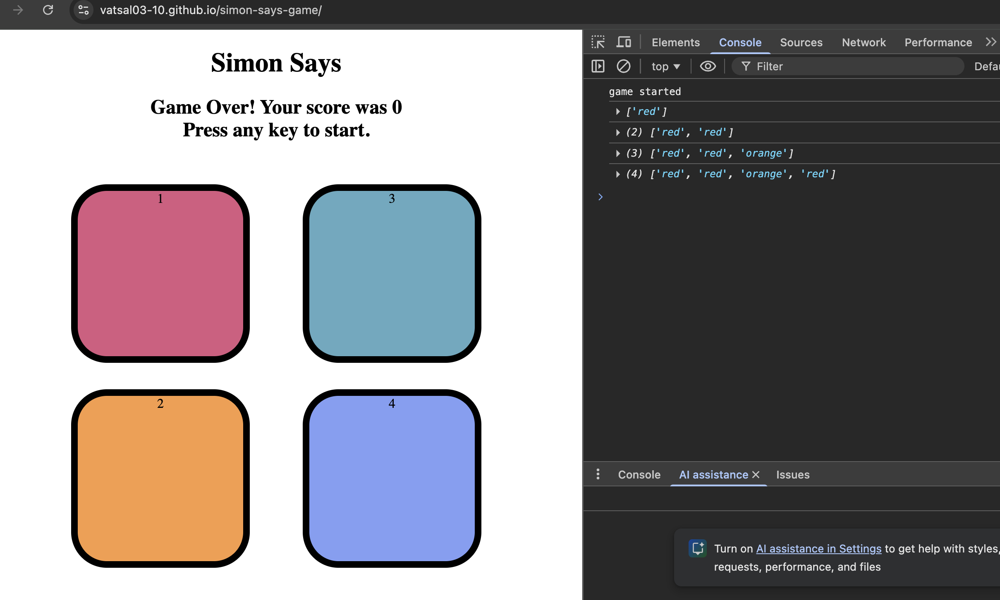

# 🎮 Simon Says Game

A fun and interactive **Simon Says memory game** built using **HTML, CSS, and JavaScript**.  
The game challenges players to remember and repeat an increasingly long sequence of colors.

🔴 **Live Demo:**  
https://vatsal03-10.github.io/simon-says-game/

---
**Screenshot**



---
## 🧠 How the Game Works

1. Press **any key** to start the game.
2. The game flashes a random color.
3. The player must click **all previous colors in the exact order**, followed by the **newly flashed color**.
4. Each correct round increases the **level** and adds one more color to the sequence.
5. If the player clicks a wrong color or breaks the order, the game ends and the **final score** is displayed.

---

## ✨ Features

- 🎨 Color-based interactive UI  
- 🚀 Level progression system  
- ⚡ Smooth game & user animations  
- ❌ Game-over detection with score display  
- 🔄 Restart by pressing any key  

---

## 🛠️ Tech Stack

- **HTML5**
- **CSS3**
- **JavaScript**

---

## 📂 Project Structure

```text
simon-says-game/
│
├── index.html        # Main HTML file
├── README.md         # Project documentation
├── screenshot.png    # Project screenshot used in README
├── css/
│   └── style.css     # Styling
├── js/
│   └── app.js        # Game logic and interactions


